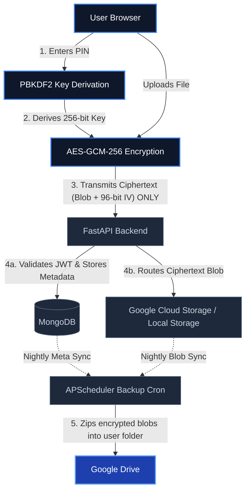
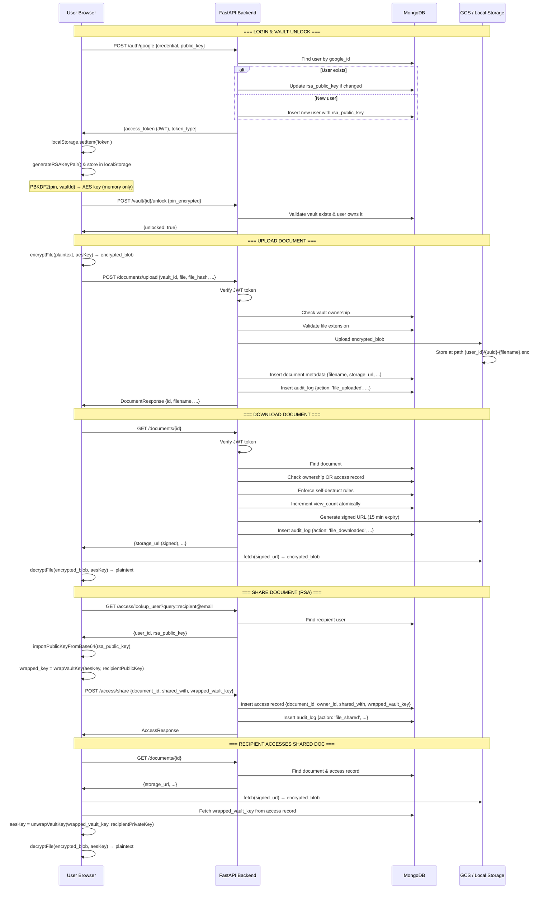

# Omnimise Secure Vault

## Project Overview

The Omnimise Secure Vault is a highly secure, privacy-first document storage application designed with a zero-knowledge architecture. The core philosophy of this platform is that the server should never have access to the plaintext contents of user files. By cryptographically isolating data on the client side before it ever touches the network, the system guarantees that even database administrators or infrastructure providers cannot read user documents.

This zero-knowledge mandate is achieved by executing all sensitive cryptographic operations natively within the user's browser using the Web Crypto API. Upon logging in with Google OAuth, the user is prompted for a secure PIN. This PIN is passed through a PBKDF2 key derivation function with 100,000 iterations to generate a strong, symmetric AES-GCM 256-bit key. Documents are encrypted on the client side using this derived vault key, and only the resulting ciphertexts are transmitted to the backend for storage in Google Cloud Storage. 

## Architecture

The system utilizes a decoupled frontend and backend architecture linked via a secure RESTful API. 

1. **Frontend (React SPA)**: Operates entirely in the user's browser. It intercepts file uploads, generates unique cryptographic nonces (Initialization Vectors), encrypts the raw binary streams, and dispatches the ciphertext to the backend API. Upon retrieval, it reverses the process, decrypting the ciphertext entirely within local memory before surfacing the file to the user.
2. **Backend (FastAPI)**: Acts as an unprivileged broker. It validates user identity via JWTs, enforces strict access control matrices stored in MongoDB, and orchestrates the arbitrary binary blobs into Google Cloud Storage (GCS) or a secure Local File Storage fallback. It never possesses the cryptographic keys.
3. **Database (MongoDB)**: Stores relationships, access permissions, temporal session metadata, and pointers to the storage blobs. It retains the user's base64-encoded encrypted RSA public keys for document sharing scenarios but is blinded to the actual file contents.
4. **Cloud Storage (Google Cloud Storage)**: Acts as the encrypted, highly durable data lake housing the raw ciphertexts (when `GCS_ENABLED=true`).
5. **Local Storage Fallback**: A local `backend/local_storage` directory that acts as a secure container for encrypted documents during local development or when cloud billing is inactive (when `GCS_ENABLED=false`).
6. **DigiLocker Integration (India)**: Proxies raw government documents into the frontend where they are wrapped with the zero-knowledge AES key before touching our cloud storage.
7. **Background Tasks (Google Drive)**: An embedded APScheduler cron service runs daily at midnight to execute completely automated ZIP backups of users' encrypted vaults into their connected Google Drive accounts. We also added a manual trigger mechanism in the dashboard.

### System Flow
```text
User Browser
     |
     | (PIN entry)
     v
PBKDF2 Key Derivation (100,000 iterations, Vault ID as salt)
     |
     v
AES-GCM-256 Encryption (96-bit random IV per file)
     |
     | (ciphertext only)
     v
FastAPI Backend (JWT validated, plaintext never seen)
     |
     +----------------+
     |                |
     v                v
MongoDB            Google Cloud Storage
(metadata,         (encrypted blobs,
 access records,    .enc files only)
 audit logs)
     |
     v
Google Drive (nightly encrypted ZIP backup)
```



## Technology Stack

| Component | Technology | Description |
| :--- | :--- | :--- |
| **Frontend** | React, Vite, Tailwind CSS | High-performance SPA with styling. |
| **Backend** | Python, FastAPI, Uvicorn | Asynchronous, type-safe REST API server. |
| **Database** | MongoDB (Motor Driver) | NoSQL document store for metadata and access schemas. |
| **Cloud Storage** | Google Cloud Storage | Highly durable object storage backend for encrypted blobs. |
| **Local Storage** | Python OS/Pathlib | Fallback local file system driver for development environments. |
| **Background Tasks** | APScheduler | Embedding async cron scheduler for Google Drive syncs. |
| **Authentication** | Google OAuth, Python-Jose | Identity federation merged with strict session JWT issuance. |

## Local Development Setup

### Prerequisites
*   Node.js (v18+)
*   Python (3.9+)
*   MongoDB running locally on default port 27017
*   Google Cloud Platform project with OAuth credentials and a GCS Bucket
*   DigiLocker API credentials (if testing government integrations)

### Backend Setup
1. Navigate to the `backend` directory.
2. Create and activate a Python virtual environment: `python -m venv venv` and `source venv/bin/activate` (or `venv\Scripts\activate` on Windows).
3. Install dependencies: `pip install -r requirements.txt`.
4. Copy the environment template: `cp .env.example .env` and populate the fields (see Environment Variables section).
5. Start the server: `uvicorn main:app --reload`. The API will be available at `http://localhost:8000`.

### Frontend Setup
1. Navigate to the `frontend` directory.
2. Install dependencies: `npm install`.
3. Copy the environment template: `cp .env.example .env` and populate the fields.
4. Start the development server: `npm run dev`. The UI will be available at `http://localhost:5173`.

### Required Environment Variables

**Backend (`backend/.env`)**
*   `MONGO_URI`: Connection string for MongoDB (default: `mongodb://localhost:27017`).
*   `DATABASE_NAME`: Name of the MongoDB database (default: `document_vault`).
*   `JWT_SECRET`: Cryptographically secure random string for signing JWTs.
*   `JWT_ALGORITHM`: Hashing algorithm for JWTs (default: `HS256`).
*   `JWT_EXPIRY_HOURS`: Token lifespan (default: `24`).
*   `GOOGLE_CLIENT_ID`: OAuth 2.0 Client ID from GCP Console.
*   `GOOGLE_CLIENT_SECRET`: OAuth 2.0 Client Secret from GCP Console.
*   `GOOGLE_REDIRECT_URI`: OAuth redirect target (default: `postmessage` for frontend callback handling).
*   `GCS_ENABLED`: Feature toggle flag to switch between native GCS (true) and Local File Storage limits (false).
*   `GCS_BUCKET_NAME`: Target Google Cloud Storage bucket name.
*   `GCS_SERVICE_ACCOUNT_JSON`: Path to the GCP Service Account credentials JSON file.
*   `FRONTEND_URL`: URL of the React application for rigorous CORS enforcement.
*   `DIGILOCKER_CLIENT_ID`: API Client ID for DigiLocker OAuth.
*   `DIGILOCKER_CLIENT_SECRET`: API Secret for DigiLocker OAuth.
*   `DIGILOCKER_REDIRECT_URI`: Server callback URL for DigiLocker code exchange.

**Frontend (`frontend/.env`)**
*   `VITE_API_URL`: Root URL of the FastAPI backend (default: `http://localhost:8000`).
*   `VITE_GOOGLE_CLIENT_ID`: OAuth 2.0 Client ID matching the backend credentials for federated login.

## API Reference

### Auth
| Method | Path | Auth Required | Description |
| :--- | :--- | :--- | :--- |
| POST | `/auth/google` | No | Exchanges Google authorization code for system JWT. Creates user profile. |
| GET | `/auth/me` | Yes | Retrieves current authenticated user profile. |
| GET | `/auth/users/{user_id}/public-key` | Yes | Retrieves the RSA public key of a specified user for document sharing. |

### Vault
| Method | Path | Auth Required | Description |
| :--- | :--- | :--- | :--- |
| POST | `/vault` | Yes | Creates a new cryptographic vault boundary for the user. |
| GET | `/vault` | Yes | Lists all vaults owned by the authenticated user. |

### Documents
| Method | Path | Auth Required | Description |
| :--- | :--- | :--- | :--- |
| POST | `/documents/upload` | Yes | Accepts AES-encrypted multipart blob and uploads to active storage provider. |
| GET | `/documents` | Yes | Lists metadata of documents within a specified authorized vault. |
| GET | `/documents/{id}` | Yes | Retrieves temporary, 15-minute V4 signed URL for secure GCS downloading, or a proxied local endpoint URL. |
| GET | `/local-files/{path}` | Yes | Secure proxy for serving encrypted binary blobs from the local filesystem during `GCS_ENABLED=false` development periods. Path traversal prevented via User ID validation. |

### Requests
| Method | Path | Auth Required | Description |
| :--- | :--- | :--- | :--- |
| POST | `/requests` | Yes | Creates an organizational request for access to a specific document type. |
| GET | `/requests` | Yes | Retrieves inbox requests pending for the authenticated user. |

### Access
| Method | Path | Auth Required | Description |
| :--- | :--- | :--- | :--- |
| POST | `/access/share` | Yes | Submits a recipient's RSA-wrapped AES key tied to a specific document. |
| GET | `/access/list` | Yes | Retrieves wrapped keys for shared documents matching the current user. |

### Messages
| Method | Path | Auth Required | Description |
| :--- | :--- | :--- | :--- |
| POST | `/messages/send` | Yes | Transmits an end-to-end encrypted messaging payload to another user. |
| GET | `/messages/inbox` | Yes | Retrieves the encrypted message queue for the current user. |

### Integrations
| Method | Path | Auth Required | Description |
| :--- | :--- | :--- | :--- |
| POST | `/backup/trigger` | Yes | Manually forces an in-memory ZIP aggregation and Google Drive backup of entire vault asynchronously. |
| GET | `/digilocker/auth` | Yes | Initiates the DigiLocker OAuth integration pipeline. |
| GET | `/digilocker/import/{uri}` | Yes | Streams raw DigiLocker document bytes securely to the frontend for algorithmic encryption. |

## Security Model

The foundation of the platform's security is its integration of various modern cryptographic layers:

*   **Zero-Knowledge Paradigm**: The server assumes a hostile or breached state. It operates under the constraint that it can only store routing metadata and ciphertext, completely insulating user privacy.
*   **PBKDF2 Key Derivation**: User PINs are combined with the Vault ID (acting as a salt) and run through 100,000 iterations of HMAC-SHA256, mathematically delaying brute-force attacks against weak PINs.
*   **AES-GCM-256 Symmetric Encryption**: Documents are encrypted utilizing military-grade AES with a 256-bit key length and a Galois/Counter Mode (GCM) layout, guaranteeing both absolute confidentiality and ciphertext authenticity (tamper evidence).
    *   **IV Generation**: Each encryption operation generates a unique 96-bit Initialization Vector using the browser's `crypto.getRandomValues()` function. The IV is prepended to the ciphertext before transmission, ensuring that identical files encrypted with the same key produce entirely different ciphertexts.
*   **File Integrity Verification**: A SHA-256 hash of the original plaintext file is computed in the browser before encryption and stored as document metadata. Upon decryption, the hash is recomputed and compared against the stored value. Any mismatch — indicating server-side file tampering — immediately halts the download and alerts the user.
*   **In-Memory Lifecycle**: The derived AES keys are housed purely in transient React Component state natively governed by the JavaScript garbage collector. Keys do not persist in `localStorage` or indexed DB structures, terminating immediately upon a page refresh or explicit browser session closure.
*   **Asymmetric Key Wrapping**: Document sharing avoids central key escrow by utilizing native Web Crypto `RSA-OAEP` schemas. Upon unlocking a vault, the frontend creates a 2048-bit RSA pair, storing the private key securely in Javascript `sessionStorage` and broadcasting the public key via base64 to the backend. The sender's client wraps the symmetric vault key specifically for the recipient's public key mathematically.
*   **Storage Abstraction Layer**: By separating the metadata pointers from the physical ciphertext blobs, the system gracefully handles dynamic switching between Google Cloud Storage and strict local development silos (`GCS_ENABLED=false`) ensuring rapid local iterating.
*   **Signed URLs**: The backend provisions heavily restricted, 15-minute time-to-live signed Google Cloud Storage endpoint URLs dynamically, deprecating permanent public exposure of blob locations.
*   **JWT Authorization**: API perimeter defenses evaluate short-lived JSON Web Tokens signed by the backend framework incorporating explicit identity claims evaluated prior to any database operation.
*   **Zero-Trust Design**: The system is designed following a zero-trust architecture, where cryptographic boundaries ensure that even in the event of full server compromise, attackers cannot decrypt user data without the client-side derived keys. The server is treated as an untrusted relay at all times.

## Known Limitations

*   **Fatal Key Loss on Session End**: Because keys reside strictly in transient memory without severe compromise of the risk profile, closing the browser implicitly locks the vault. If the user forgets their PIN, mathematical recovery of the documents is permanently technically impossible.
*   **Inactivity Lock**: The vault automatically locks after 5 minutes of user inactivity, destroying the in-memory key. This is a security feature but may interrupt active workflows.
*   **HTTP Polling Latency**: Real-time notifications and encrypted messaging rely on client-side HTTP `setInterval` polling (every 5 seconds) rather than persistent bi-directional WebSockets, causing minor visual latency up to the polling interval boundary and incrementally increased server load.
*   **Single-Region Cloud Storage**: Current infrastructure targets a singular Google Cloud Storage bucket natively determined by environment parameters, potentially exposing users to geographical latency outside the bucket's home region footprint.

## Security Features Summary

| Feature | Implementation |
| :--- | :--- |
| **Encryption** | AES-GCM-256 with unique 96-bit IV per file |
| **Key Derivation** | PBKDF2-HMAC-SHA256, 100,000 iterations |
| **Key Storage** | In-memory only, wiped on lock or inactivity |
| **Document Sharing** | RSA-OAEP 2048-bit asymmetric key wrapping |
| **Access Control** | JWT + MongoDB access matrix + expiry enforcement |
| **Audit Trail** | Full forensic log of all vault actions with IP |
| **Self-Destruct** | View-count and time-based document destruction |
| **File Validation** | Extension whitelist enforced server-side |
| **Inactivity Lock** | Auto-lock after 5 minutes, explicit memory wipe |
| **File Integrity** | SHA-256 hash computed pre-encryption, verified post-decryption in browser |
| **Backup** | Nightly encrypted ZIP to Google Drive |

---

## Token Lifecycle (JWT)

### Token Creation (Login)

When a user logs in via Google OAuth:

1. **Frontend** → Sends Google ID token to `POST /auth/google`
2. **Backend** verifies token with Google, extracts: `google_id`, `email`, `name`, `picture`
3. **User Lookup**: Database checks if `google_id` exists
   - **New user**: Creates user record with `rsa_public_key` from frontend
   - **Existing user**: Updates `rsa_public_key` if user logged in from new device
4. **JWT Generation**: `create_access_token({sub: user_id, exp: now + 7 days})`
   - Signed with `SECRET_KEY` using `HS256` algorithm
   - Payload contains only `sub` (MongoDB user ID) and `exp` (expiration timestamp)
5. **Response**: `{ access_token: "<jwt>", token_type: "bearer" }`
6. **Frontend stores**: `localStorage.setItem('token', access_token)`

**Token contents (decoded JWT):**
```json
{
  "sub": "<mongodb_user_id>",
  "exp": 1747603200
}
```

### Token Validation (Per Request)

Every request to a protected endpoint includes `Authorization: Bearer <token>`:

1. **Request Interceptor** (`frontend/src/services/api.js`): Reads token from `localStorage`, adds to headers
2. **Backend Route Handler**: `@Depends(get_current_user)`
   - Extracts token from `Authorization` header
   - Calls `verify_token(token)` → `jwt.decode(token, SECRET_KEY, algorithms=["HS256"])`
   - **If valid**: Returns decoded payload with `sub` (user_id)
   - **If invalid/expired**: Returns `None` → raises `HTTPException(401)`
3. **User Lookup**: Queries `db.users.find_one({_id: ObjectId(user_id)})`
   - **Not found**: Returns `HTTPException(404)`
   - **Found**: Converts to `UserResponse` and passes to route handler
4. **Route executes** with authenticated user context

### Token Expiry & Invalidation

- **Expiration time**: 7 days (`ACCESS_TOKEN_EXPIRE_MINUTES = 60 * 24 * 7`)
- **Refresh mechanism**: None — user must log in again after 7 days
- **Auto-logout on 401**: Response interceptor (`frontend/src/services/api.js`) detects `401` status
  - Clears `localStorage` token
  - Clears `VaultKeyContext` (in-memory AES key)
  - Redirects to `/login`
- **Manual logout**: Clears `localStorage`, `VaultKeyContext`, and redirects

---

## Document Upload Flow

### Step 1: File Encryption (Browser)

```javascript
// User selects file → encryptFile(fileBuffer, aesKey)
const iv = crypto.getRandomValues(new Uint8Array(12));  // 96-bit random IV
const encrypted = await crypto.subtle.encrypt(
  { name: "AES-GCM", iv },
  aesKey,
  fileBuffer
);
// Prepend IV to ciphertext
const encrypted_blob = combine(iv, encrypted);  // 12 bytes IV + ciphertext
```

**Result**: Encrypted binary blob, ready to upload.

### Step 2: Upload Request

```javascript
const formData = new FormData();
formData.append('vault_id', vaultId);
formData.append('file', new Blob([encrypted_blob], { type: 'application/octet-stream' }));
formData.append('file_hash', sha256(original_plaintext));
formData.append('self_destruct_after_views', views || null);
formData.append('self_destruct_at', datetime || null);

api.post('/documents/upload', formData, { headers: { 'Content-Type': 'multipart/form-data' } })
```

### Step 3: Backend Processing

**Route Handler**: `POST /documents/upload`

1. **Authentication**: `get_current_user` validates JWT
2. **Authorization**: `check_vault_access(vault_id, user_id)` → must own vault, else `403 Forbidden`
3. **File Validation**:
   - Extension whitelist: `{pdf, docx, doc, png, jpg, jpeg, zip, txt}`
   - Rejects unknown types → `400 Bad Request`
4. **Storage**:
   - **If `GCS_ENABLED=true`**:
     - Generates unique path: `{user_id}/{uuid}-{filename}.enc`
     - Uploads to Google Cloud Storage bucket
   - **If `GCS_ENABLED=false`**:
     - Saves to local disk: `backend/local_storage/{user_id}/{uuid}-{filename}.enc`
5. **Metadata Recording**: Inserts into MongoDB `documents` collection:
   ```json
   {
     "_id": ObjectId,
     "filename": "document.pdf",
     "vault_id": "<vault_id>",
     "owner_id": "<user_id>",
     "content_type": "application/pdf",
     "size_bytes": 1024000,
     "storage_url": "user_id/uuid-document.pdf.enc",
     "file_hash": "sha256_hash",
     "self_destruct_after_views": null,
     "self_destruct_at": null,
     "view_count": 0,
     "created_at": timestamp
   }
   ```
6. **Audit Log**: Inserts into `audit_logs` collection
   ```json
   {
     "user_id": "<user_id>",
     "action": "file_uploaded",
     "document_id": "<doc_id>",
     "ip_address": "192.168.1.1",
     "timestamp": timestamp
   }
   ```
7. **Response**: Returns `DocumentResponse` with document metadata

**Crucially**: Backend never decrypts, never sees plaintext. Stores only encrypted blob path and metadata.

---

## Document Download & View Flow

### Step 1: Get Document Info

```
GET /documents/{document_id}
Authorization: Bearer <token>
```

### Step 2: Backend Authorization & Checks

1. **Fetch Document**: `db.documents.find_one({_id: ObjectId(document_id)})`
2. **Access Control**: Check if user is authorized:
   - **Owner**: `db.vaults.find_one({_id: vault_id, user_id: current_user.id})`
   - **Shared**: `db.access.find_one({shared_with: current_user.id, document_id})`
     - Verify `access.expires_at` not in past
   - Neither → `403 Forbidden`
3. **Self-Destruct Enforcement**:
   - Check `self_destruct_at < now` → hard delete → `410 Gone`
   - Check `view_count >= self_destruct_after_views` → hard delete → `410 Gone`
4. **Atomic View Counter Increment**: `db.documents.update_one({$inc: {view_count: 1}})`
5. **Re-validate View Limit**: Check updated view count again
6. **Generate Access URL**:
   - **GCS**: V4 signed URL with 15-minute expiry
   - **Local**: `http://localhost:8000/local-files/{storage_url}`
   - **Google Drive**: Proxy endpoint `/documents/{id}/download`
7. **Audit Log**: Insert download action
8. **Response**:
   ```json
   {
     "id": "<document_id>",
     "filename": "document.pdf",
     "content_type": "application/pdf",
     "size_bytes": 1024000,
     "storage_url": "<signed_url_or_proxy_path>"
   }
   ```

### Step 3: Browser Downloads Encrypted Blob

```javascript
const response = await fetch(storage_url);  // Uses signed URL (expires in 15 min)
const encrypted_blob = await response.arrayBuffer();
```

### Step 4: Browser Decrypts Locally

```javascript
const decrypted = await decryptFile(encrypted_blob, aesKey);
// Extracts first 12 bytes as IV
// AES-GCM decrypts rest using IV + aesKey
// Verifies file_hash matches plaintext
// Surfaces plaintext to user (download or display)
```

---

## Document Sharing Flow (RSA Key Wrapping)

### Step 1: Prepare Recipient's Public Key

**Sender's Browser**:

```javascript
const response = await api.get('/access/lookup_user?query=recipient@email.com');
// Response: { user_id: "<id>", email: "...", rsa_public_key: "<base64>" }

const recipientPublicKey = await importPublicKeyFromBase64(response.data.rsa_public_key);
// Converts base64 SPKI to Web Crypto CryptoKey
```

### Step 2: Wrap Vault Key with RSA-OAEP

```javascript
const wrapped_aes_key_base64 = await wrapVaultKey(
  aesVaultKey,           // Sender's AES-256 vault key (in memory)
  recipientPublicKey     // Recipient's RSA-2048 public key
);

// wrapVaultKey implementation:
// crypto.subtle.wrapKey(
//   "raw",
//   aesVaultKey,
//   recipientPublicKey,
//   { name: "RSA-OAEP" }  // ← Uses recipient's public key
// ) → base64 wrapped blob
```

**Result**: AES key encrypted **specifically for the recipient's RSA public key**. Only the recipient (with their private key) can decrypt it.

### Step 3: Create Share Record

```javascript
api.post('/access/share', {
  document_id: "<doc_id>",
  shared_with: "<recipient_user_id>",
  wrapped_vault_key: "<base64_wrapped_aes_key>",
  expires_at: optional_datetime
});
```

### Step 4: Backend Records Share

1. **Authorization**: Verify sender owns the document's vault
2. **Insert Access Record** into `db.access`:
   ```json
   {
     "_id": ObjectId,
     "document_id": "<doc_id>",
     "owner_id": "<sender_user_id>",
     "shared_with": "<recipient_user_id>",
     "wrapped_vault_key": "<base64_wrapped_aes_key>",
     "expires_at": optional_datetime,
     "granted_at": timestamp
   }
   ```
3. **Audit Log**: Log "file_shared" action
4. **Response**: Confirm share successful

### Step 5: Recipient Accesses Document

1. **Fetch**: `GET /documents/{document_id}`
   - Backend finds `access` record for this user
   - Returns signed URL + document metadata
2. **Get Wrapped Key** from `db.access.find_one({shared_with: user_id, document_id})`
   - Extract `wrapped_vault_key` → base64 string
3. **Unwrap AES Key** (Recipient's Browser):
   ```javascript
   const unwrapped_aes_key = await unwrapVaultKey(
     wrapped_vault_key_base64,
     recipientPrivateKey  // Recipient's private RSA key (from localStorage)
   );
   
   // unwrapVaultKey implementation:
   // crypto.subtle.unwrapKey(
   //   "raw",
   //   wrapped_blob,
   //   recipientPrivateKey,  // ← Only recipient has this
   //   { name: "RSA-OAEP" },
   //   { name: "AES-GCM", length: 256 },
   //   true,
   //   ["encrypt", "decrypt"]
   // ) → AES CryptoKey
   ```
4. **Decrypt Document**: Use recovered AES key to decrypt the blob (same as normal download)

---

## RSA Key Pair Generation & Storage

### Key Pair Creation (First Login)

**When logging in for the first time**, `frontend/src/pages/Login.jsx`:

```javascript
const keyPair = await generateRSAKeyPair();
// crypto.subtle.generateKey(
//   {
//     name: "RSA-OAEP",
//     modulusLength: 2048,
//     publicExponent: new Uint8Array([1, 0, 1]),
//     hash: "SHA-256"
//   },
//   true,
//   ["wrapKey", "unwrapKey"]
// )

const publicKeyBase64 = await exportPublicKeyAsBase64(keyPair.publicKey);   // SPKI format
const privateKeyBase64 = await exportPrivateKeyAsBase64(keyPair.privateKey); // PKCS8 format

localStorage.setItem('rsa_public_key', publicKeyBase64);
localStorage.setItem('rsa_private_key', privateKeyBase64);

// Send public key to backend during login
await login(oauthPayload, publicKeyBase64);  // POST /auth/google
```

### Key Storage

| Key | Storage Location | Lifetime | Purpose |
| :--- | :--- | :--- | :--- |
| **RSA Public Key** | MongoDB (user record) + localStorage | Permanent | Allows others to wrap keys for sharing documents with you |
| **RSA Private Key** | localStorage only | Session lifetime | Decrypt wrapped keys (unwrap) when receiving shared documents |
| **AES Vault Key** | Memory (React VaultKeyContext) | Until vault lock/logout | Encrypt/decrypt your own documents |

### Updating Public Key on New Device

If user logs in from a new device:

1. New browser generates fresh RSA key pair
2. Posts new public key to backend: `POST /auth/register-public-key`
3. Backend updates user record: `db.users.update_one({$set: {rsa_public_key: new_key}})`
4. Previous device's shares still work (encrypted for old public key)
5. New shares from others use the new public key

---

## Complete Request Flow Diagram



