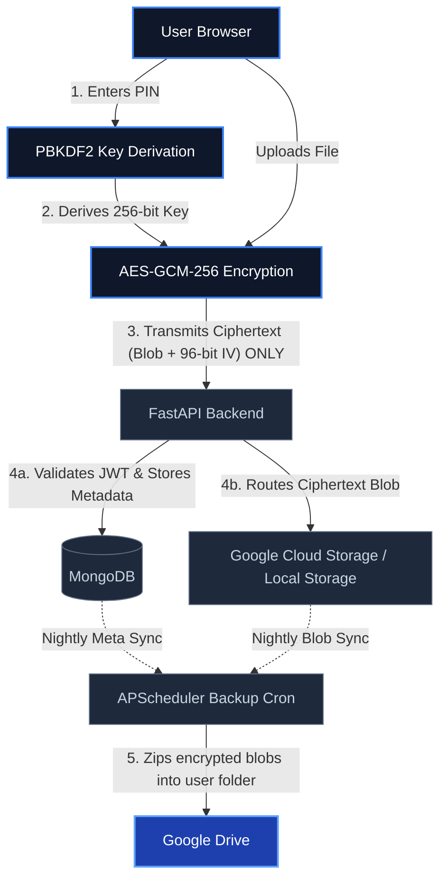

# Omnimise Secure Vault

## Project Overview

The Omnimise Secure Vault is a highly secure, privacy-first document storage application designed with a zero-knowledge architecture. The core philosophy of this platform is that the server should never have access to the plaintext contents of user files. By cryptographically isolating data on the client side before it ever touches the network, the system guarantees that even database administrators or infrastructure providers cannot read user documents.

This zero-knowledge mandate is achieved by executing all sensitive cryptographic operations natively within the user's browser using the Web Crypto API. Upon logging in with Google OAuth, the user is prompted for a secure PIN. This PIN is passed through a PBKDF2 key derivation function with 100,000 iterations to generate a strong, symmetric AES-GCM 256-bit key. Documents are encrypted on the client side using this derived vault key, and only the resulting ciphertexts are transmitted to the backend for storage in Google Cloud Storage. 

## Architecture

The system utilizes a decoupled frontend and backend architecture linked via a secure RESTful API. 

1. **Frontend (React SPA)**: Operates entirely in the user's browser. It intercepts file uploads, generates unique cryptographic nonces (Initialization Vectors), encrypts the raw binary streams, and dispatches the ciphertext to the backend API. Upon retrieval, it reverses the process, decrypting the ciphertext entirely within local memory before surfacing the file to the user.
2. **Backend (FastAPI)**: Acts as an unprivileged broker. It validates user identity via JWTs, enforces strict access control matrices stored in MongoDB, and orchestrates the arbitrary binary blobs into Google Cloud Storage (GCS) or a secure Local File Storage fallback. It never possesses the cryptographic keys.
3. **Database (MongoDB)**: Stores relationships, access permissions, temporal session metadata, and pointers to the storage blobs. It retains the user's base64-encoded encrypted RSA public keys for document sharing scenarios but is blinded to the actual file contents.
4. **Cloud Storage (Google Cloud Storage)**: Acts as the encrypted, highly durable data lake housing the raw ciphertexts (when `GCS_ENABLED=true`).
5. **Local Storage Fallback**: A local `backend/local_storage` directory that acts as a secure container for encrypted documents during local development or when cloud billing is inactive (when `GCS_ENABLED=false`).
6. **DigiLocker Integration (India)**: Proxies raw government documents into the frontend where they are wrapped with the zero-knowledge AES key before touching our cloud storage.
7. **Background Tasks (Google Drive)**: An embedded APScheduler cron service runs daily at midnight to execute completely automated ZIP backups of users' encrypted vaults into their connected Google Drive accounts. We also added a manual trigger mechanism in the dashboard.

### System Flow
```text
User Browser
     |
     | (PIN entry)
     v
PBKDF2 Key Derivation (100,000 iterations, Vault ID as salt)
     |
     v
AES-GCM-256 Encryption (96-bit random IV per file)
     |
     | (ciphertext only)
     v
FastAPI Backend (JWT validated, plaintext never seen)
     |
     +----------------+
     |                |
     v                v
MongoDB            Google Cloud Storage
(metadata,         (encrypted blobs,
 access records,    .enc files only)
 audit logs)
     |
     v
Google Drive (nightly encrypted ZIP backup)
```



## Technology Stack

| Component | Technology | Description |
| :--- | :--- | :--- |
| **Frontend** | React, Vite, Tailwind CSS | High-performance SPA with styling. |
| **Backend** | Python, FastAPI, Uvicorn | Asynchronous, type-safe REST API server. |
| **Database** | MongoDB (Motor Driver) | NoSQL document store for metadata and access schemas. |
| **Cloud Storage** | Google Cloud Storage | Highly durable object storage backend for encrypted blobs. |
| **Local Storage** | Python OS/Pathlib | Fallback local file system driver for development environments. |
| **Background Tasks** | APScheduler | Embedding async cron scheduler for Google Drive syncs. |
| **Authentication** | Google OAuth, Python-Jose | Identity federation merged with strict session JWT issuance. |

## Local Development Setup

### Prerequisites
*   Node.js (v18+)
*   Python (3.9+)
*   MongoDB running locally on default port 27017
*   Google Cloud Platform project with OAuth credentials and a GCS Bucket
*   DigiLocker API credentials (if testing government integrations)

### Backend Setup
1. Navigate to the `backend` directory.
2. Create and activate a Python virtual environment: `python -m venv venv` and `source venv/bin/activate` (or `venv\Scripts\activate` on Windows).
3. Install dependencies: `pip install -r requirements.txt`.
4. Copy the environment template: `cp .env.example .env` and populate the fields (see Environment Variables section).
5. Start the server: `uvicorn main:app --reload`. The API will be available at `http://localhost:8000`.

### Frontend Setup
1. Navigate to the `frontend` directory.
2. Install dependencies: `npm install`.
3. Copy the environment template: `cp .env.example .env` and populate the fields.
4. Start the development server: `npm run dev`. The UI will be available at `http://localhost:5173`.

### Required Environment Variables

**Backend (`backend/.env`)**
*   `MONGO_URI`: Connection string for MongoDB (default: `mongodb://localhost:27017`).
*   `DATABASE_NAME`: Name of the MongoDB database (default: `document_vault`).
*   `JWT_SECRET`: Cryptographically secure random string for signing JWTs.
*   `JWT_ALGORITHM`: Hashing algorithm for JWTs (default: `HS256`).
*   `JWT_EXPIRY_HOURS`: Token lifespan (default: `24`).
*   `GOOGLE_CLIENT_ID`: OAuth 2.0 Client ID from GCP Console.
*   `GOOGLE_CLIENT_SECRET`: OAuth 2.0 Client Secret from GCP Console.
*   `GOOGLE_REDIRECT_URI`: OAuth redirect target (default: `postmessage` for frontend callback handling).
*   `GCS_ENABLED`: Feature toggle flag to switch between native GCS (true) and Local File Storage limits (false).
*   `GCS_BUCKET_NAME`: Target Google Cloud Storage bucket name.
*   `GCS_SERVICE_ACCOUNT_JSON`: Path to the GCP Service Account credentials JSON file.
*   `FRONTEND_URL`: URL of the React application for rigorous CORS enforcement.
*   `DIGILOCKER_CLIENT_ID`: API Client ID for DigiLocker OAuth.
*   `DIGILOCKER_CLIENT_SECRET`: API Secret for DigiLocker OAuth.
*   `DIGILOCKER_REDIRECT_URI`: Server callback URL for DigiLocker code exchange.

**Frontend (`frontend/.env`)**
*   `VITE_API_URL`: Root URL of the FastAPI backend (default: `http://localhost:8000`).
*   `VITE_GOOGLE_CLIENT_ID`: OAuth 2.0 Client ID matching the backend credentials for federated login.

## API Reference

### Auth
| Method | Path | Auth Required | Description |
| :--- | :--- | :--- | :--- |
| POST | `/auth/google` | No | Exchanges Google authorization code for system JWT. Creates user profile. |
| GET | `/auth/me` | Yes | Retrieves current authenticated user profile. |
| GET | `/auth/users/{user_id}/public-key` | Yes | Retrieves the RSA public key of a specified user for document sharing. |

### Vault
| Method | Path | Auth Required | Description |
| :--- | :--- | :--- | :--- |
| POST | `/vault` | Yes | Creates a new cryptographic vault boundary for the user. |
| GET | `/vault` | Yes | Lists all vaults owned by the authenticated user. |

### Documents
| Method | Path | Auth Required | Description |
| :--- | :--- | :--- | :--- |
| POST | `/documents/upload` | Yes | Accepts AES-encrypted multipart blob and uploads to active storage provider. |
| GET | `/documents` | Yes | Lists metadata of documents within a specified authorized vault. |
| GET | `/documents/{id}` | Yes | Retrieves temporary, 15-minute V4 signed URL for secure GCS downloading, or a proxied local endpoint URL. |
| GET | `/local-files/{path}` | Yes | Secure proxy for serving encrypted binary blobs from the local filesystem during `GCS_ENABLED=false` development periods. Path traversal prevented via User ID validation. |

### Requests
| Method | Path | Auth Required | Description |
| :--- | :--- | :--- | :--- |
| POST | `/requests` | Yes | Creates an organizational request for access to a specific document type. |
| GET | `/requests` | Yes | Retrieves inbox requests pending for the authenticated user. |

### Access
| Method | Path | Auth Required | Description |
| :--- | :--- | :--- | :--- |
| POST | `/access/share` | Yes | Submits a recipient's RSA-wrapped AES key tied to a specific document. |
| GET | `/access/list` | Yes | Retrieves wrapped keys for shared documents matching the current user. |

### Messages
| Method | Path | Auth Required | Description |
| :--- | :--- | :--- | :--- |
| POST | `/messages/send` | Yes | Transmits an end-to-end encrypted messaging payload to another user. |
| GET | `/messages/inbox` | Yes | Retrieves the encrypted message queue for the current user. |

### Integrations
| Method | Path | Auth Required | Description |
| :--- | :--- | :--- | :--- |
| POST | `/backup/trigger` | Yes | Manually forces an in-memory ZIP aggregation and Google Drive backup of entire vault asynchronously. |
| GET | `/digilocker/auth` | Yes | Initiates the DigiLocker OAuth integration pipeline. |
| GET | `/digilocker/import/{uri}` | Yes | Streams raw DigiLocker document bytes securely to the frontend for algorithmic encryption. |

## Security Model

The foundation of the platform's security is its integration of various modern cryptographic layers:

*   **Zero-Knowledge Paradigm**: The server assumes a hostile or breached state. It operates under the constraint that it can only store routing metadata and ciphertext, completely insulating user privacy.
*   **PBKDF2 Key Derivation**: User PINs are combined with the Vault ID (acting as a salt) and run through 100,000 iterations of HMAC-SHA256, mathematically delaying brute-force attacks against weak PINs.
*   **AES-GCM-256 Symmetric Encryption**: Documents are encrypted utilizing military-grade AES with a 256-bit key length and a Galois/Counter Mode (GCM) layout, guaranteeing both absolute confidentiality and ciphertext authenticity (tamper evidence).
    *   **IV Generation**: Each encryption operation generates a unique 96-bit Initialization Vector using the browser's `crypto.getRandomValues()` function. The IV is prepended to the ciphertext before transmission, ensuring that identical files encrypted with the same key produce entirely different ciphertexts.
*   **In-Memory Lifecycle**: The derived AES keys are housed purely in transient React Component state natively governed by the JavaScript garbage collector. Keys do not persist in `localStorage` or indexed DB structures, terminating immediately upon a page refresh or explicit browser session closure.
*   **Asymmetric Key Wrapping**: Document sharing avoids central key escrow by utilizing native Web Crypto `RSA-OAEP` schemas. Upon unlocking a vault, the frontend creates a 2048-bit RSA pair, storing the private key securely in Javascript `sessionStorage` and broadcasting the public key via base64 to the backend. The sender's client wraps the symmetric vault key specifically for the recipient's public key mathematically.
*   **Storage Abstraction Layer**: By separating the metadata pointers from the physical ciphertext blobs, the system gracefully handles dynamic switching between Google Cloud Storage and strict local development silos (`GCS_ENABLED=false`) ensuring rapid local iterating.
*   **Signed URLs**: The backend provisions heavily restricted, 15-minute time-to-live signed Google Cloud Storage endpoint URLs dynamically, deprecating permanent public exposure of blob locations.
*   **JWT Authorization**: API perimeter defenses evaluate short-lived JSON Web Tokens signed by the backend framework incorporating explicit identity claims evaluated prior to any database operation.
*   **Zero-Trust Design**: The system is designed following a zero-trust architecture, where cryptographic boundaries ensure that even in the event of full server compromise, attackers cannot decrypt user data without the client-side derived keys. The server is treated as an untrusted relay at all times.

## Known Limitations

*   **Fatal Key Loss on Session End**: Because keys reside strictly in transient memory without severe compromise of the risk profile, closing the browser implicitly locks the vault. If the user forgets their PIN, mathematical recovery of the documents is permanently technically impossible.
*   **Inactivity Lock**: The vault automatically locks after 5 minutes of user inactivity, destroying the in-memory key. This is a security feature but may interrupt active workflows.
*   **HTTP Polling Latency**: Real-time notifications and encrypted messaging rely on client-side HTTP `setInterval` polling (every 5 seconds) rather than persistent bi-directional WebSockets, causing minor visual latency up to the polling interval boundary and incrementally increased server load.
*   **Single-Region Cloud Storage**: Current infrastructure targets a singular Google Cloud Storage bucket natively determined by environment parameters, potentially exposing users to geographical latency outside the bucket's home region footprint.

## Security Features Summary

| Feature | Implementation |
| :--- | :--- |
| **Encryption** | AES-GCM-256 with unique 96-bit IV per file |
| **Key Derivation** | PBKDF2-HMAC-SHA256, 100,000 iterations |
| **Key Storage** | In-memory only, wiped on lock or inactivity |
| **Document Sharing** | RSA-OAEP 2048-bit asymmetric key wrapping |
| **Access Control** | JWT + MongoDB access matrix + expiry enforcement |
| **Audit Trail** | Full forensic log of all vault actions with IP |
| **Self-Destruct** | View-count and time-based document destruction |
| **File Validation** | Extension whitelist enforced server-side |
| **Inactivity Lock** | Auto-lock after 5 minutes, explicit memory wipe |
| **Backup** | Nightly encrypted ZIP to Google Drive |

